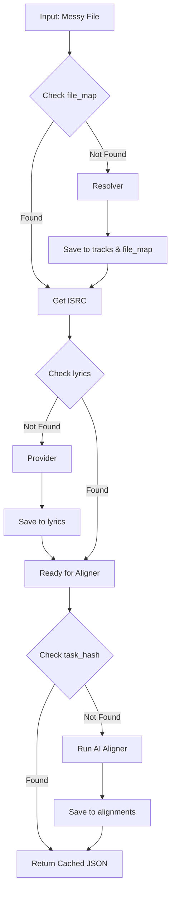

# Lyricutils

A modern, extensible Python library to **download, create, and align lyrics** with precision and control.

---
## Key features

* **Multi-Backend Support**: Seamlessly switch between mutliple backend providers for forced-alignment.
* **Lyric Alignment**: Tools to sync text to audio timestamps.
* **Modern Python**: Built for Python 3.11+ using type hints and async-first principles.
* **Extensible Architecture**: Easily plug in your own custom lyric providers.

## Caching

