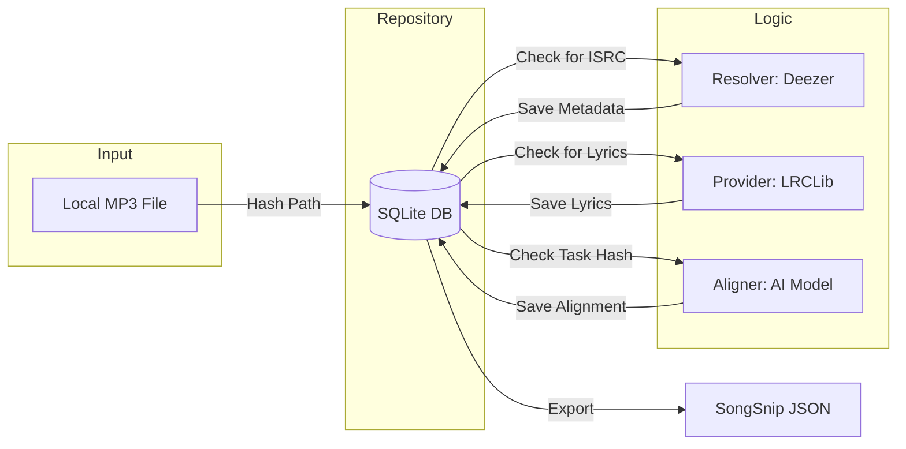

# System Flowchart

```mermaid
graph LR
    subgraph Input
    A[Local MP3 File]
    end

    subgraph Repository
    B[(SQLite DB)]
    end

    subgraph Logic
    C[Resolver: Deezer]
    D[Provider: LRCLib]
    E[Aligner: AI Model]
    end

    A -->|Hash Path| B
    B -->|Check for ISRC| C
    C -->|Save Metadata| B
    B -->|Check for Lyrics| D
    D -->|Save Lyrics| B
    B -->|Check Task Hash| E
    E -->|Save Alignment| B
    B -->|Export| F[SongSnip JSON]
```
